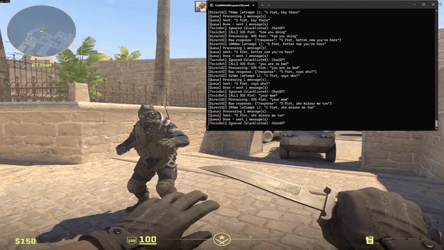
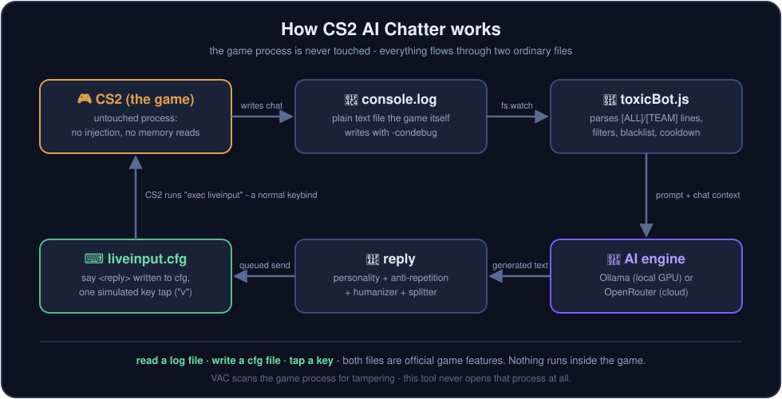
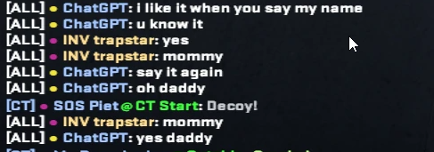

<div align="center">

# 🎯 CS2 AI Chatter

**An AI that talks trash (or makes friends) in your Counter-Strike 2 matches.**

Reads the in-game chat, generates replies with AI - local Ollama or OpenRouter cloud models - and sends them back into the game. Fully controlled from a web dashboard.

[](LICENSE)
[](https://nodejs.org)
[](#requirements)
[](#providers)

</div>

---

<div align="center">



*Live demo - real match, real replies. Crisper version with sound: [demo.mp4](docs/demo.mp4)*

</div>

<!-- 📸 SCREENSHOTS
     Save your captures as docs/dashboard.png and docs/ingame.png,
     then uncomment the block below. Suggested shots: the dashboard
     settings page, the AI tester, and an in-game chat moment.

<div align="center">

### 📸 Screenshots


*The dashboard - personality, models, filters, blacklist, and a live AI tester.*


*The bot holding its own in match chat.*

</div>

---
-->


## ✨ Features

- 💬 **Reads real match chat** - watches CS2's console log, event-driven (no polling lag)
- 🧠 **Two AI providers** - free OpenRouter cloud models or fully-local Ollama on your GPU
- 🎭 **9 personality tones** - witty, toxic, troll, savage, sarcastic, chaotic, friendly...
- ⚡ **Fast/smart model routing** - quick banter uses a fast model, "explain X" gets a smarter one
- 🔍 **Model search with pricing** - browse every OpenRouter model with cost per 1000 messages
- 🛡️ **Anti-spam guardrails** - reply cooldown, message splitting, repetition detection
- 🕹️ **Web dashboard** - live status, AI tester, chat history, per-player blacklist
- 🧢 **Human behavior mode** - random delays, occasional typos, skip chance

## 🛡️ Is this VAC-bannable?

**No - by design, there is nothing for VAC to detect.** VAC looks for tampering with the game: injected code, hooked functions, modified memory. This tool does **none** of that - it never opens, attaches to, or injects into the CS2 process at all. It works purely through two official game features:

- **Reads** `console.log` - a plain text file *CS2 itself* writes when launched with `-condebug`
- **Writes** `liveinput.cfg` - a config file CS2 executes through a completely normal keybind (`bind "v" "exec liveinput"`)

From the game's perspective, nothing unusual is running - it's writing a log and executing a cfg, exactly as Valve built it to.

> [!WARNING]
> **FACEIT / ESEA: status unsure - don't risk it.** Kernel-level anti-cheats monitor far more than VAC, including input automation, and we can't verify how they'd judge the simulated key press. Keep this off FACEIT accounts.
>
> Also: *not VAC-detectable* ≠ *allowed*. Automating chat may violate the Steam/CS2 Terms of Service, and toxic messages can still earn communication or game bans through **player reports** - no anti-cheat needed. Use at your own risk, ideally not on an account you care about.

## 🚀 Quickstart

```bash
git clone https://github.com/drippycatcs/CS2-Ai-Chatter.git
cd CS2-Ai-Chatter
npm install
npm run setup     # wizard: auto-detects CS2, picks provider, writes config
npm start         # bot + dashboard → http://localhost:3000
```

**Or just double-click `start.bat`** - it installs dependencies and runs the wizard on first launch.

### One-time CS2 configuration

1. **Steam** → right-click CS2 → *Properties* → *Launch Options*:
   ```
   -condebug
   ```
2. **CS2 console** (~) - bind the send key once:
   ```
   bind "v" "exec liveinput"
   ```
   (Pick another key if `v` is taken, and match it in *Settings → Exec Key*.)
3. Join a match. When someone chats, the bot answers.

## ⚙️ How it works



The whole loop runs through **two ordinary files** - the game process is never touched:

1. CS2 writes every chat line to `console.log` (its official `-condebug` feature)
2. The bot watches that file and parses new `[ALL]`/`[TEAM]` messages
3. Worth replying? The message plus recent chat context goes to the AI
4. The reply is personality-styled, de-duplicated, and split to chat length
5. It's written as `say <reply>` into `liveinput.cfg`, and one simulated key tap makes CS2 `exec` it - the same as you pressing a bound key

| Part | Role |
|---|---|
| `toxicBot.js` | Watches the console log, parses chat, queues & sends replies |
| `directAI.js` | AI engine - filtering, fast/smart routing, anti-repetition, personality |
| `dashboard.js` | Web dashboard backend (localhost only) |
| `keypress/` | Simulates the exec key via Windows FFI - no build tools needed |

## 🤖 Providers & which model to pick

You have three options, and the trade-offs are real:

| Option | Speed | Reliability | Cost |
|---|---|---|---|
| 🖥️ **Ollama (local)** | depends on *your* GPU | always available | free |
| 🆓 **OpenRouter free models** | okay | ⚠️ unreliable - rate-limited at peak times | free |
| ⭐ **Cheap paid model** (recommended) | fast, consistent | never rate-limited | ~half a cent per game |

### ⭐ Recommended: Gemini 2.5 Flash Lite (paid)

The sweet spot: **`google/gemini-2.5-flash-lite`** - replies in about a second, never rate-limited, and costs **$0.10 per 1000 messages** - a busy game with ~60 bot replies is **about half a cent**. A few dollars of [OpenRouter credit](https://openrouter.ai/settings/credits) lasts hundreds of games. Find it via **Search All Models** in Settings and set it as both Fast and Smart.

Real output from this exact model:



### ☁️ OpenRouter free models - fine for trying it out

1. Grab a free key at [openrouter.ai/keys](https://openrouter.ai/keys)
2. Enter it in the setup wizard or *Settings → OpenRouter*
3. Pick from the free-model list (⭐ recommended ones first)

**The catch:** free models share capacity with everyone. At peak hours they hit upstream rate limits and your bot goes quiet mid-match (it auto-retries and falls back to your other model, but a limited model is a limited model). Great for testing, frustrating as a daily driver.

### 🖥️ Ollama - fully local, offline, and free forever

```bash
# install from https://ollama.com, then:
ollama pull llama3.2:3b
```

Choose *Local (Ollama)* and pick your models - a small one for *Fast* (banter), optionally a bigger one for *Smart* (questions).

**The catch:** speed depends entirely on your PC. A small model on a decent GPU answers in ~1s, but on weaker hardware (or with a big model) replies can take 5-15+ seconds - and the model eats VRAM *while CS2 is running*, which can cost you FPS. Best if you have GPU headroom to spare.

> [!TIP]
> **Cap your FPS when using Ollama.** By default CS2 uses every GPU cycle it can get, leaving nothing for the model - replies crawl and your frametimes spike when one generates. Capping FPS (`fps_max 240` in the CS2 console, or slightly below your monitor's refresh rate) reserves GPU headroom, so the model answers faster *and* your FPS stays stable instead of dipping mid-fight.

## 🎛️ Dashboard

Open **http://localhost:3000** while running:

| Tab | What you control |
|---|---|
| **AI Tester** | Try messages without being in a game |
| **Personality** | Bot name, tone, style, custom system prompt |
| **Human Behavior** | Delays, typos, skip chance |
| **Smart Filters** | Skip greetings, callouts, single words, spam |
| **Blacklist** | Players the bot must ignore (add yourself!) |
| **History** | Recent conversations |
| **Settings** | Provider, models, temperature, cooldown, exec key |

<details>
<summary><b>📄 Config reference (config.json)</b></summary>

Created by `npm run setup` from `config.example.json`. Gitignored - it may hold your API key.

| Field | Description |
|---|---|
| `console_log_path` | Path to CS2's `console.log` (needs `-condebug`) |
| `cs2_cfg_path` | Path to `cfg/liveinput.cfg` the bot writes replies into |
| `ai_provider` | `"local"` (Ollama) or `"openrouter"` |
| `model_fast` / `model_smart` | Ollama models for chat / complex requests |
| `openrouter_model_fast` / `_smart` | OpenRouter model ids |
| `exec_key` | Key the bot presses to send (must match your CS2 bind) |
| `queue_delay_ms` | Delay between multi-part messages |
| `reply_cooldown_ms` | Minimum time between replies, `0` = off (avoids spam kicks) |
| `enable_all_chat` / `enable_team_chat` | Which chat scopes to answer |
| `send_to_game` | `false` = dry-run, nothing sent to CS2 |

</details>

<details>
<summary><b>🧰 All commands</b></summary>

| Command | What it does |
|---|---|
| `npm start` | Run bot + dashboard (opens browser) |
| `npm run setup` | Interactive setup wizard |
| `npm run check` | Validate Node, deps, config, paths, provider |
| `npm run bot` | Bot only |
| `npm run dashboard` | Dashboard only |
| `npm test` | Parser / splitter / extraction smoke tests |

</details>

<details>
<summary><b>🔧 Troubleshooting</b></summary>

| Symptom | Fix |
|---|---|
| Bot sees no messages | CS2 missing `-condebug`, or wrong `console_log_path` → `npm run check` |
| Replies never appear in chat | Missing bind: `bind "v" "exec liveinput"` in CS2 console; CS2 must be focused |
| "Ollama connection failed" | Start Ollama or switch provider to OpenRouter - the bot keeps running |
| "Model X is rate-limited" | Free-tier congestion - the bot retries + falls back automatically; pick another model or a cheap paid one |
| "Invalid API key" | Regenerate at [openrouter.ai/keys](https://openrouter.ai/keys) |
| Dashboard unreachable from another PC | Intentional - localhost only, it has no login |

</details>

---

<div align="center">

**[MIT License](LICENSE)** - built for fun, use responsibly. 🎮

</div>
